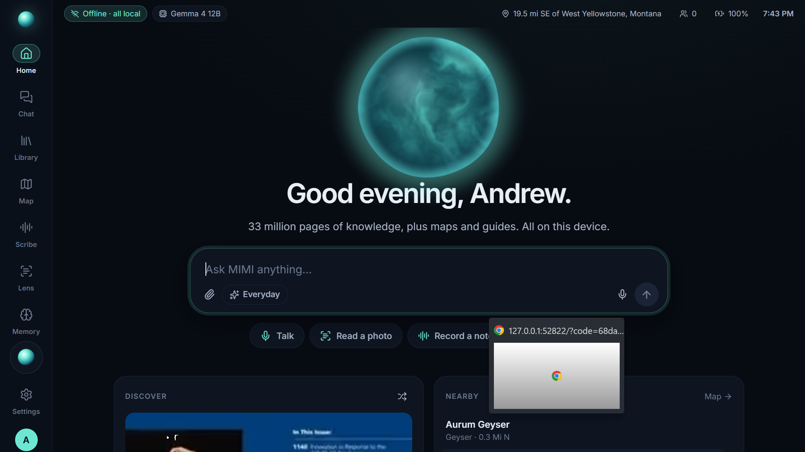
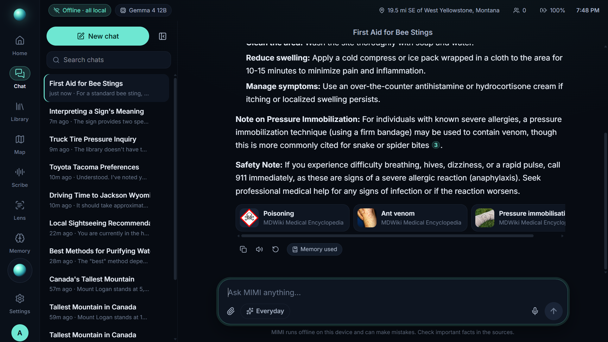
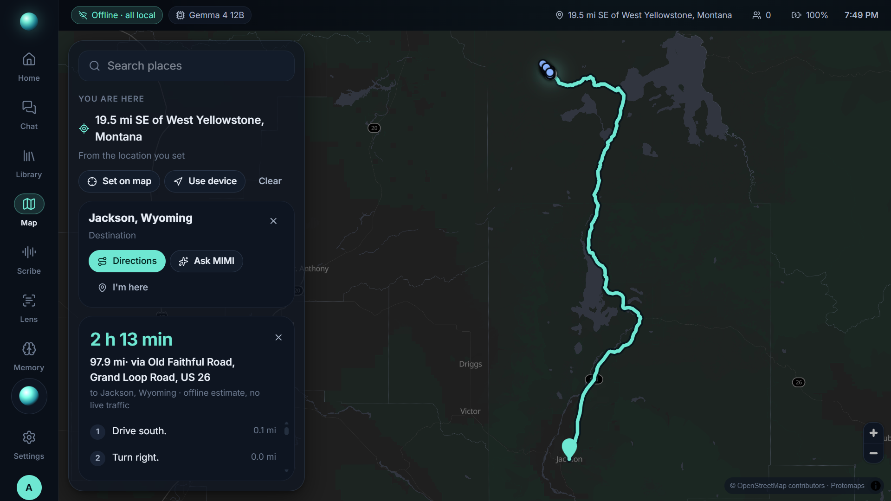
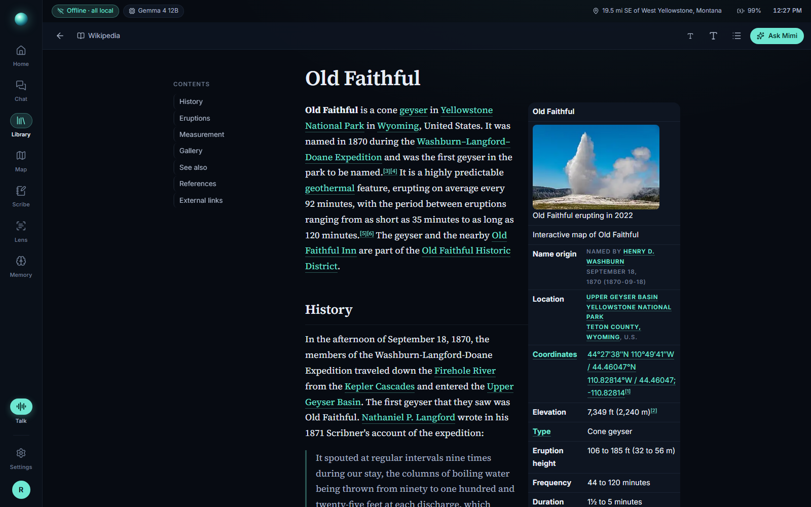

# MIMI — Machine Intelligence, Minus the Internet

*An open-source, fully offline AI field station. The name nods to **Mímir**, the Norse keeper of wisdom whose counsel Odin carried.*



MIMI turns a small PC into an assistant that works with **zero internet**. The reference device is a handheld ONEXPLAYER F1 (Ryzen 7 7840U, 16 GB).

- **Ask anything, with sources.** Answers come from a local open-weights model (Gemma 4 12B) grounded in an offline library: all of English Wikipedia with images, WikiMed, iFixit, Wikivoyage, nine Stack Exchange sites, Wiktionary, survival guides, Project Gutenberg shelves and TED talks. That's 26 collections and 161 GB. Every factual answer cites the article it came from.
- **Reads photos.** Lens does instant on-device OCR, and the vision model can explain, translate or identify what it sees.
- **Talks.** Full-screen voice conversation (Whisper and Kokoro, all on the device), or push-to-talk on the controller.
- **Takes notes.** Scribe records, transcribes, and writes the summary, key points and action items.
- **Knows where you are.** Offline maps of the US and Canada, "what's near me" (GeoNames plus 1.2M geotagged Wikipedia articles), and **turn-by-turn driving directions** with time and distance (Valhalla).
- **Remembers you, transparently.** Suggested memories wait for your OK. Every one can be seen, edited, pinned, paused or erased.
- **Shares.** Phones join the MIMI Wi-Fi and open `https://mimi.local` as guests or users. Or, with no hotspot hardware, any phone or laptop on the same network opens the address shown in Settings and signs in with full access.
- **Extensible.** Slash commands in the chat box (`/eli5`, `/translate spanish …`, `/steps`, `/quiz`…). Drop a Python file into `tools/` to give MIMI a new ability, like the included sunrise/sunset and unit-conversion tools. See [tools/README.md](tools/README.md).
- **Feels like a frontier app.** A native full-screen app with a living "Well" orb, gamepad navigation, a command palette, 12 settings sections and dark, light and OLED themes.

| Chat with citations | Offline directions | Library reader |
|---|---|---|
|  |  |  |

## Quick start (Windows 10/11 x64)

```powershell
git clone https://github.com/AndrewKenady/mimi.git
cd mimi
powershell -ExecutionPolicy Bypass -File scripts\setup.ps1
.\MIMI.exe
```

`setup.ps1` installs a portable Python and Node inside the folder, downloads the engines, models, library and maps (about 190 GB, resumable, from their original publishers), builds the geodata and routing graph, the UI, and `MIMI.exe`. It needs no administrator rights. Use `-NoContent` for code and runtimes only.

Development:

```powershell
cd core; ..\python\python.exe -m mimi serve          # Core + built UI on http://127.0.0.1:7600
cd ui;   npm run dev                                   # hot-reloading UI on :5173 (proxies to Core)
cd core; ..\python\python.exe -m pytest               # tests
```

## How it's built

| Piece | Tech |
|---|---|
| `core/` MIMI Core | Python 3.12, FastAPI, SQLite, llama.cpp (Vulkan) model manager, kiwix-serve, faster-whisper, Kokoro-ONNX, RapidOCR, Valhalla, zeroconf |
| `ui/` MIMI app | SvelteKit (Svelte 5), Tailwind 4, MapLibre + PMTiles, WebGL "Well" |
| `shell/` MIMI.exe | WinForms + WebView2, compiled with the C# compiler that ships with Windows |

See [docs/ARCHITECTURE.md](docs/ARCHITECTURE.md), the original [plan](docs/PLAN.md), [design decisions](docs/DECISIONS.md) (including where we deviated from the plan) and [benchmarks](docs/BENCHMARKS.md).

## Sharing with phones

Settings → Sharing & access → **Access from other devices** turns on the local HTTPS server and announces `mimi.local`. Allow it through Windows Firewall once (Windows asks for approval). Then either:

- **Same network:** any phone, tablet or laptop on the same Wi-Fi or Ethernet opens the address listed there (for example `https://192.168.1.105/` or `https://mimi.local/`). The owner signs in with their name and PIN and gets everything: chat, library, maps, Scribe, Lens, memory and settings.
- **MIMI Wi-Fi:** phones join the `MIMI` network from a travel router or the Windows hotspot and scan the QR codes.

Install `MIMI-Local-CA.crt` (linked on the sign-in page) on a phone so the browser trusts the connection and allows the microphone and camera.

## Licenses

MIMI's own code is MIT. Models, engines and content keep their own licenses: Gemma 4 and Qwen3.5 (Apache-2.0), Wikipedia and Stack Exchange (CC BY-SA), OpenStreetMap (ODbL), GeoNames (CC BY), TED (CC BY-NC-ND) and others. MIMI is **non-commercial**, so MIMI drives and images may not be sold.
